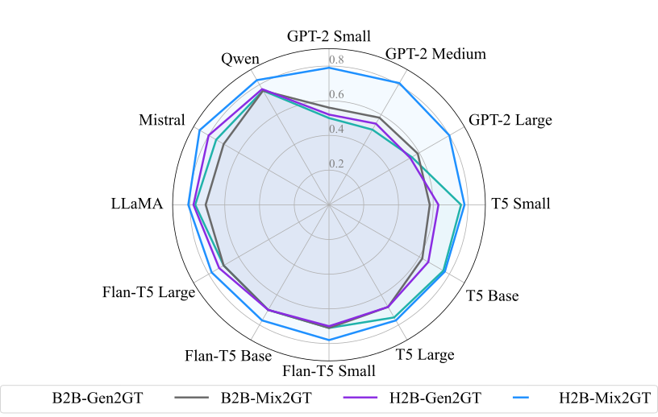
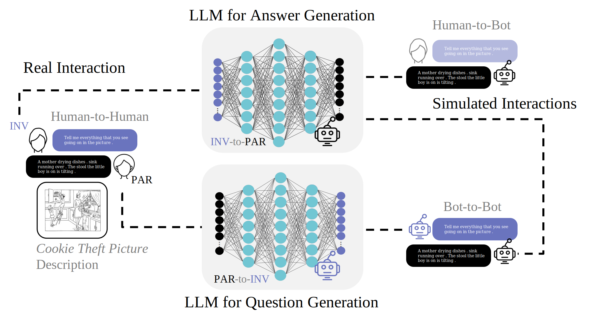

# Generating AD Narratives

This repository packages the training, evaluation, and embedding workflows used for the AD narrative generation paper into a reproducible structure with standardized parameters across model families.

## Paper Visuals

### Main Results Snapshot



### Methodology / Pipeline



## What Changed

- Removed hard-coded local paths.
- Removed embedded `wandb` API keys.
- Standardized CLI arguments across `t5`, `flan-t5`, and `gpt2`.
- Centralized training and generation defaults in one config file.
- Standardized output locations under `artifacts/`.

## Repository Layout

- `configs/experiments.json`: shared defaults and model registry
- `scripts/train.py`: fine-tuning entry point
- `scripts/evaluate.py`: generation and metric export
- `scripts/embed_texts.py`: embedding extraction for generated or ground-truth text
- `src/ad_narratives/`: shared utilities

## Expected Data Layout

The scripts expect CSV files with `question` and `answer` columns.

```text
data/
  train_QA_AD_data.csv
  val_QA_AD_data.csv
  test_QA_AD_data.csv
  train_QA_HC_data.csv
  val_QA_HC_data.csv
  test_QA_HC_data.csv
```

If you want to use the `all_tog` variant from the original code, point `--data-dir` to that directory instead.

## Install

```bash
pip install -r requirements.txt
```

## Train

```bash
python scripts/train.py --family flan-t5 --size base --group AD --data-dir ./data
python scripts/train.py --family t5 --size large --group HC --data-dir ./data/all_tog
python scripts/train.py --family gpt2 --size small --group AD --data-dir ./data
```

## Evaluate

```bash
python scripts/evaluate.py --family flan-t5 --size base --group AD --data-dir ./data --combine-splits
```

## Embeddings

```bash
python scripts/embed_texts.py --input artifacts/predictions/flan-t5_base_AD_predictions.csv --text-column generated_answer --label generated
python scripts/embed_texts.py --input artifacts/groundtruth/Groundtruth.csv --text-column sentence --label groundtruth
```

## Notes

- `gpt2` size mapping is standardized as `small -> gpt2`, `base -> gpt2-medium`, `large -> gpt2-large`.
- All families now share the same generation defaults unless explicitly overridden.
- Training defaults are centralized; family-specific overrides are kept minimal and transparent.
